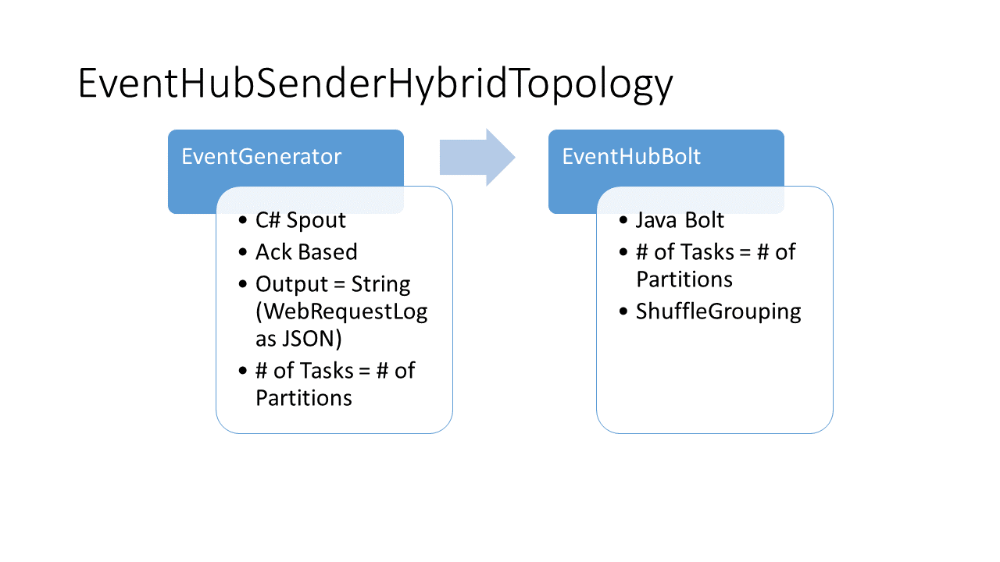

# Real Time ETL Example
This is an end-to-end example that allows you to deploy all the required Azure resources and deploy the SCP.Net based topologies.
The end-to-end example has been automated using the HDInsight.Examples.CLI tool.

## Getting Started
Run the ```realtimeetl\build_realtimeetl.cmd``` to build and run the end-to-end example.

After you are you are done, you can use the ```realtimeetl\cleanup_realtimeetl.cmd``` to delete all associated azure resources.

## HDInsight.Examples.CLI
This tool helps you to deploy Azure Storage, Event Hub, HDInsight Storm and HBase clusters and submit topologies remotely.
The tool uses various Azure related SDKs from nuget.org to create the resources in your subscription.

There are some first time run questions about saving your configurations for subsequent runs, follow the on-screen instructions.

All the logs from the examples CLI are also stored inside a logs directory in the bin folder which can be later used for reference or reporting errors.

## The SCP.Net Topologies

### Event Sender Topology
The first topology that is deployed as part of this example is an event sender topology. It generates random Web Request Log type of events that are converted to JSON and pushed to EventHub.
Following image is an illustration of how the topology looks like:


The current example uses the hybrid variation of the topology that has C# spout which generates a random web request log event, serializes it to JSON and writes into EventHub using the java based EventHubBolt.
There is another topology available if you want to do this entirely in C#, which uses the C# EventHubWriter bolt instead of the java bolt.

### Event Aggregation Topology (Eventhub -> Storm -> HBase)
This is the main topology in this  real time ETL example. It is a hybrid aggregation topology (i.e. java spout, C# bolts).

The events are read from EventHub using the java based EventHubSpout and then aggregated per minute in storm.
The resulting aggregations are then stored into a HBase cluster.

Following image is an illustration of how the topology looks like:


The sample data (a randomly generated web request log) is put into EventHub using a hybrid sender topology (i.e. c# spout, java bolt).
```
Sample Data Example (from logs):
Last emitted tuple: SeqId = 130000 Value = {"Timestamp":"2/15/2015 2:10:23 AM","Client":"127.0.0.1","Uri":"/foo/bar","Method":"DELETE","Result":"NotFound"}
```

The aggregations are done based on occurrence of each SecondaryKey per PrimaryKey in that minute.
```
Aggregation Example (from logs):
Last aggregation tuple emitted: DateTime = 2/15/2015 2:10:00 AM PrimaryKey = NotFound SecondaryKey = 127.0.0.1 AggregatedValue = 921
```

The HBase RowKey/Column design allows each time to store one variation of dimension/fact by using PrimaryKey#Timestamp as RowKey and SecondaryKey as ColumnName.
```
RowKey/Column/Value Example:
Rowkey = NotFound#20150215005500
Column = v:127.0.0.1
Cell Value = 921
```

#### Notes
* An event can be any time of an service or operational event like  a web request log, service operation log etc
* Aggregations in a bolt happen on a combination of one dimension (PrimaryKey) against the count of fact (SecondaryKey) for each window (based on Timestamp).
* You can create multiple variations/instances of the bolt or the topology to change the value of PrimaryKey & SecondaryKey Fields. For example:
  * You can set up a bolt that counts Results for each Client or vice-versa a bolt counts Client for each Result based on the input configuration.
  * Each of these aggregation bolts end up in a different HBase table for fast index-based retrieval. For e.g.
    * ResultClient -> This table will have row keys like Result#Timestamp, column name will be Client value and the cell value is the aggregated value. 
    * To get the results for a particular Result & Time window one will run a index scan on HBase like: NotFound#20150215005500 through NotFound#20150215010000
* For ease of manageability one can also deploy another topology altogether so that aggregations of one type will not impact other.

## References
### Nuget
* [HDInsight SDK](http://www.nuget.org/packages/Microsoft.WindowsAzure.Management.HDInsight/)
* [HBase .Net SDK - Rest based](http://www.nuget.org/packages/Microsoft.HBase.Client/)
* [SCP.Net - Client SDK](http://www.nuget.org/packages/Microsoft.SCP.Net.SDK/)
